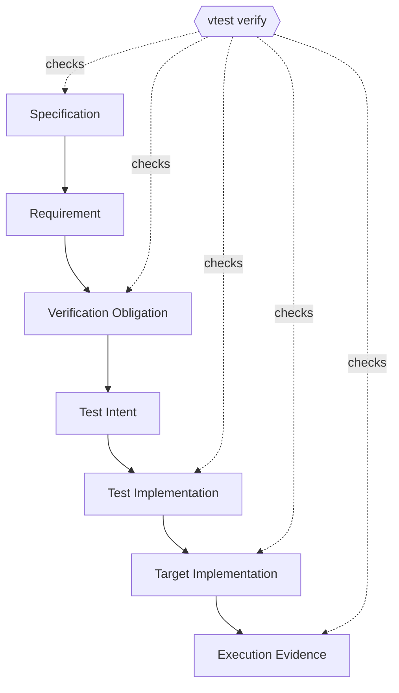

<div align="center">

# SpecTracer

### Know not only that your tests pass — know what they prove.

**Fail-closed verification and traceability for AI-parallel software development.**


`SpecTracer` connects specifications, verification obligations, tests, source code, audits, and execution evidence into one traceable verification graph.

SpecTracer is language- and test-runner-agnostic by design.

**The current CLI binary is `vtest`.**

</div>

---

## Why SpecTracer?

A green test suite answers one question:

> **Did these tests pass?**

It does **not** automatically answer:

- Did every requirement get a test?
- Does the test verify the behavior the specification actually asks for?
- Does the test call the implementation it claims to test?
- Does the target result actually reach an assertion?
- Is the evidence still valid after the code changed?
- Was the declared target executed at all?
- Is an old audit being mistaken for proof about the current revision?

Those gaps get more dangerous when multiple coding agents work in parallel. Code can move faster than the evidence that is supposed to justify it.

SpecTracer is built for that gap.



**If a required link is missing, stale, ambiguous, mismatched, or not checked, SpecTracer does not call it OK.**

---

## The idea in one sentence

> **Turn “the tests are green” into “this specification is backed by current, inspectable evidence.”**

SpecTracer is not another testing framework. It is a verification layer around your tests and development process.

| Question | Test runner | Coverage tool | SpecTracer |
|---|:---:|:---:|:---:|
| Did the test process pass? | ✓ | — | ✓* |
| What requirement is this test supposed to prove? | — | — | ✓ |
| Did the declared target get called? | — | partial | ✓ |
| Was the target result actually verified? | — | — | ✓ |
| Is this audit/evidence still current after edits? | — | — | ✓* |
| Can incomplete verification silently become `OK`? | Possible | Possible | **No** (fail-closed) |

`*` Execution Evidence and full end-to-end verification are later acceptance milestones; see [Project status](#project-status).

---

## 60-second tour

This is the current procedure.

### 1. Build the CLI

```bash
cargo install --path crates/vtest-cli
vtest --help
```

### 2. Initialize verification metadata

```bash
vtest init --name my-project
```

This creates the canonical `.verify/` layout.

### 3. Register a specification

```bash
vtest spec add \
  --id SPEC-CALC \
  --path docs/calculator.md \
  --title "Calculator behavior"
```

### 4. Add a requirement and a Verification Obligation

```bash
vtest req add \
  --id REQ-CALC-001 \
  --summary "Addition returns the arithmetic sum" \
  --spec SPEC-CALC \
  --sections "§1"

vtest vo add \
  --id VO-CALC-001 \
  --claim "add(a, b) returns a + b" \
  --req REQ-CALC-001 \
  --spec SPEC-CALC \
  --sections "§1"
```

### 5. Bind a test to the obligation and its target

The example below uses Rust, which is the first supported validation target.

```rust
/// @vtest.id TEST-CALC-001
/// @vtest.covers VO-CALC-001
/// @vtest.target src/lib.rs::add
/// @vtest.intent verifies that add returns the arithmetic sum
#[test]
fn adds_two_numbers() {
    assert_eq!(add(2, 3), 5);
}
```

The annotation is not just documentation. It gives the test an identity, states what it claims to cover, identifies the intended source target, and records its human-readable intent.

### 6. Scan and audit

```bash
vtest scan
vtest audit static --all
vtest verify --items static_audit --summary
```

For automation:

```bash
vtest --format json scan
vtest --format json verify --items static_audit
```

---

## Fail-closed by design

SpecTracer treats “not proven” as different from “proven.”

A verification item can be:

```text
PASS
FAIL
MISMATCH
MISSING
NOT_CHECKED
NOT_EXECUTED
STALE
UNKNOWN
```

For complete verification, **only `PASS` is OK**.

That means:

```text
old PASS + changed source      != PASS
missing audit                 != PASS
analysis cannot prove safety  != PASS
out-of-scope check            != PASS
partial graph                 != PASS
```

This is intentional. SpecTracer is designed to preserve uncertainty instead of laundering it into confidence.

---

## Traceability model

SpecTracer separates three kinds of truth:

1. **Declaration** — what the project says should be verified.
2. **Implementation** — the actual test and target code.
3. **Evidence** — what was audited, executed, and observed.

The system compares them; it does not silently rewrite one to match another.

```text
Specification
    ↓
Requirement
    ↓
Verification Obligation
    ↓
Test Intent
    ↓
Test Implementation
    ↓
Target Implementation
    ↓
Execution Evidence
```

A mismatch is surfaced as a mismatch. Deciding whether the specification, test, or implementation should change remains a separate engineering decision.

---

## Canonical project data

SpecTracer keeps canonical records under `.verify/`:

```text
.verify/
├── config.yaml      # project configuration
├── spec/            # specification references
├── req/             # requirements
├── vo/              # verification obligations
├── rel/             # explicit relations
├── forms/           # structured operation schemas
├── approvals/       # append-only approvals
├── audits/          # append-only audit records
├── evidence/        # execution evidence
└── cache/           # derived data; safe to rebuild
```

The design avoids a giant shared registry file. Independent entities live in independent files, which makes the format friendlier to parallel branches and parallel agents.

Derived indexes and graphs are rebuilt from canonical data rather than becoming a second source of truth.

---

## Built for AI-parallel development

SpecTracer assumes a development environment where multiple agents may independently:

- implement different slices,
- write or edit tests,
- review changes,
- audit semantics,
- and merge work concurrently.

The verification layer therefore favors:

- **stable IDs** over positional assumptions,
- **content hashes** over “this passed sometime before,”
- **append-only evidence** over mutable conclusions,
- **structured operations** over unconstrained metadata editing,
- **machine-readable JSON** for agent and CI integration,
- **conservative UNKNOWN** over unjustified certainty.

The planned MCP surface exposes the same core operations to AI agents instead of creating a second behavior model.

---

## Project status

> **Status below means acceptance evidence, not code presence.** Some later-milestone implementation may already exist, but it is intentionally not advertised as complete until its milestone flow passes.

| Milestone | Scope | Acceptance |
|---|---|:---:|
| S0 | Workspace, canonical layout, shared model | ✅ PASS |
| M1 | Scan, registry, integrity diagnostics | ✅ PASS |
| M2 | SPEC / REQ / VO / approval flows | ✅ PASS |
| M3 | Deterministic static audit | ✅ PASS |
| M4 | Test execution and Evidence freshness | ⏳ NOT_CHECKED |
| M5 | Agent-delegated semantic audit | ⏳ NOT_CHECKED |
| M6 | Full 11-item fail-closed verification/reporting | ⏳ NOT_CHECKED |
| M7 | Target execution verification via coverage | ⏳ NOT_CHECKED |
| M8 | Structured Test Operations | ⏳ NOT_CHECKED |
| M9 | MCP parity | ⏳ NOT_CHECKED |

The acceptance ledger lives at [`tests/ACCEPTANCE.md`](tests/ACCEPTANCE.md).

---

## Where SpecTracer is heading

The target end-to-end verification surface is eleven independent checks:

1. `spec_coverage`
2. `vo_decomposition`
3. `vo_coverage`
4. `test_existence`
5. `static_audit`
6. `semantic_audit`
7. `impl_consistency`
8. `test_execution`
9. `runtime_result`
10. `target_execution`
11. `evidence_validity`

The goal is not to make every check “green” by assumption. The goal is to make the provenance of every green result inspectable.

---

## A tool should be able to say “I don't know”

One of SpecTracer's core design rules is that deterministic analysis must not pretend to understand more than it does.

For example, if a test calls into code outside the deterministic analysis boundary, SpecTracer should not conclude:

> “The target definitely was not called.”

It should conclude:

> **`UNKNOWN` — the available deterministic evidence is insufficient.**

That distinction matters when verification results are consumed by autonomous agents.

---

## CI and agent-friendly interfaces

The CLI supports human-readable text and JSON output:

```bash
vtest scan
vtest --format json scan
```

Exit codes are designed for automation:

| Code | Meaning |
|---:|---|
| `0` | requested operation/scope is OK |
| `1` | verification NG |
| `2` | usage/input error |
| `3` | internal error |

MCP support is planned as milestone M9 and will reuse the same core behavior rather than reimplementing verification logic.

---

## What SpecTracer is not

SpecTracer is **not**:

- a replacement for `cargo test`,
- a replacement for code coverage,
- a magical “AI says the code is correct” button,
- a system that automatically edits the specification until the build becomes green,
- or a reason to trust an untraceable PASS.

It is infrastructure for making claims about software **explicit, bounded, and auditable**.

---

## Repository layout

```text
crates/
├── vtest-model    # shared entities, hashes, diagnostics, states
├── vtest-store    # canonical record persistence
├── vtest-scan     # Rust scanning and structured test operations
├── vtest-audit    # deterministic static audit
├── vtest-exec     # test execution and evidence
├── vtest-verify   # fail-closed aggregation
├── vtest-cli      # CLI application layer
└── vtest-mcp      # MCP adapter milestone

docs/              # requirements, specifications, detailed design
.verify/           # dogfooded verification metadata
tests/             # fixtures and acceptance ledger
```

SpecTracer dogfoods its own verification model as the implementation grows.

---

## Contributing

Contributions are welcome, especially around:

- adversarial fixtures that expose false confidence,
- conservative static analysis,
- evidence freshness and reproducibility,
- semantic-audit protocols for coding agents,
- CI ergonomics,
- and MCP integration.

A useful contribution should make the verification contract stronger, not merely make more cases display `PASS`.

Before declaring a milestone complete, add reproducible evidence to [`tests/ACCEPTANCE.md`](tests/ACCEPTANCE.md).

---

## Why the name “SpecTracer”?

Because the core question is not only:

> “Did the test run?”

It is:

> **“Can I trace this result all the way back to the specification it is supposed to justify?”**

---

## License

MIT.

---

<div align="center">

### Building software with coding agents?

If you want **evidence instead of vibes**, star the repository and follow the project as the verification chain grows from static audit to end-to-end execution evidence.

</div>
